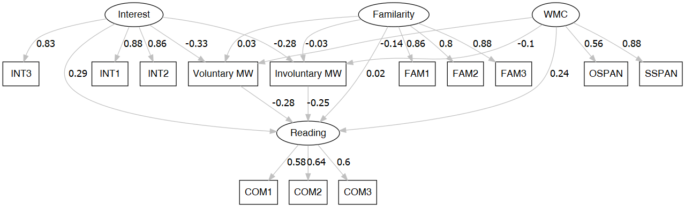

```{r setup, include=FALSE}
knitr::opts_chunk$set(echo = TRUE, message = FALSE, warning = FALSE, cache = TRUE, results = "markup")
```

## Loading libraries


```{r}

library(tidyverse)
library(knitr)
library(lavaan)
library(lavaanPlot)
library(psych)
library(DiagrammeR)
library(DiagrammeRsvg)
library(rsvg)

```

## Reading data from CSV

```{r, results='markup'}

df <- read_csv("Reading_Header.csv") # reading data


df <- df %>% 
  #mutate(across(.cols = c(starts_with('INT'), starts_with('FAM')), .fns = ~as.character(.x))) %>% # recoding as character
  mutate(across(.cols = where(is.numeric), .fns = ~ifelse(.x == 999999, NA, .x))) %>%  # recoding missing value
  mutate(across(.cols = where(is.character), .fns = ~ifelse(.x %in% '999999', NA, .x)))   # recoding missing value

glimpse(df)

summary(df)


```


## Code for producing Table-1


```{r}


corr.lv.model <- '

# latent variable definitions 

lat_COM =~ COM1 + COM2 + COM3 
lat_INT =~ INT1 + INT2 + INT3
lat_FAM =~ FAM1 + FAM2 + FAM3
lat_WMC =~ OSPAN + SSPAN


# covariances

VOL ~~ INV
lat_INT ~~ lat_WMC
lat_INT ~~ lat_FAM
lat_INT ~~ lat_COM
lat_COM ~~ lat_FAM
lat_COM ~~ lat_WMC
lat_FAM ~~ lat_WMC


'


fit.lv.model <- cfa(model = corr.lv.model, data = df, cluster = 'SUBJECT') # Confirmatory factor model for correlation

summary(fit.lv.model, standardized=TRUE) # In covariance table std.lv includes the correlation


# Estimating Cronbach’s alpha for Latent variable

alpha(df %>% select(starts_with("COM"))) # Estimate for Comprehension
alpha(df %>% select(starts_with("INT")) %>% mutate_all(as.numeric)) # Estimate for Interest
alpha(df %>% select(starts_with("FAM")) %>% mutate_all(as.numeric)) # Estimate for Familarity
alpha(df %>% select(ends_with("PAN")))  # Estimate for WMC


```


##  Code for producing Table-2


```{r}

myModel <- readLines("model.lav")


cat(myModel, fill = TRUE)


fit <- sem(model = myModel, data = df, cluster = 'SUBJECT')

summary(fit, standardized=TRUE)


```


##   Code for producing Figure-2


```{r, results='asis'}


labels = list(lat_INT = "Interest", lat_FAM = "Familarity", lat_WMC = "WMC", lat_COM = "Reading", VOL = "Voluntary MW", INV = "Involuntary MW")


grph <- lavaanPlot(model = fit, stand = TRUE, 
           labels = labels, node_options = list(shape = "box", fontname = "Helvetica"), 
           edge_options = list(color = "grey"), coef = TRUE)


tmp<-capture.output(rsvg_png(charToRaw(export_svg(grph)),'SEM.png'))

cat('{#fig:SEM}\n\n')

```


## Code for producing Table-4


```{r, results='markup'}


df %>% select(-SUBJECT, -TEXT) %>% lowerCor(digits = 2)


describe(df %>% select(-SUBJECT, -TEXT)) %>% rownames_to_column() %>% kable(digits = 2)

```


